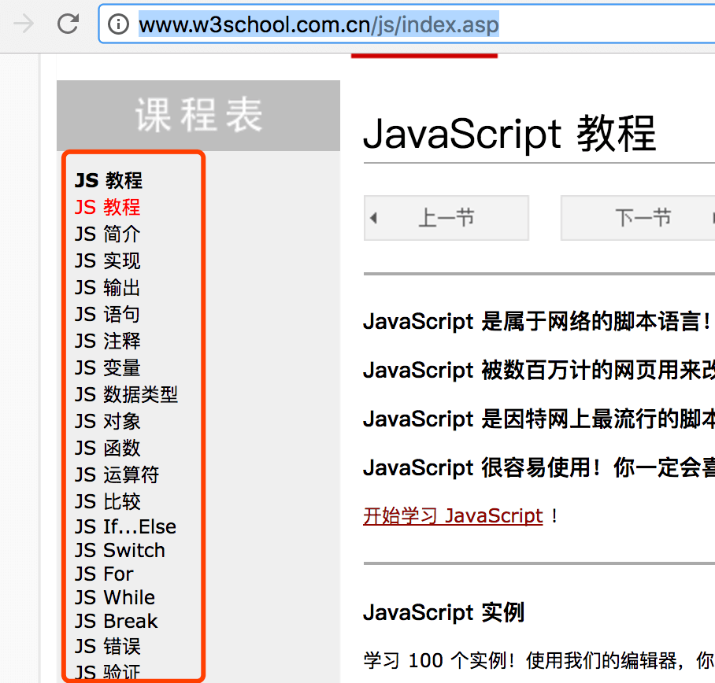

# 作业4-js基础语法篇
## 目的
js语法基础篇

## 资源
1) [JavaScript简易教程 v0.3.0 - 颜海镜](https://github.com/iamjoel/front-end-community/blob/master/zero/06-js-grammer/README.md)     
2) [w3c基础教程](http://www.w3school.com.cn/js/index.asp) (下图内容为必读)


## 作业
1) 补全下面的函数
```
    // 对 a 和 b 做加法
    function add(a, b) {
      // 你写的内容
    }

    add(1, 2) // 返回值 3
    add(1, -2) // 返回值 -1
```
2) 补全下面的函数
```
    function shouldWork(date) {
      // 你写的内容。分别实现用 if 和 switch 实现。
    }

    shouldWork('周一') // 返回值是 上班
    shouldWork('周二') // 返回值是 上班
    shouldWork('周三') // 返回值是 上班
    shouldWork('周四') // 返回值是 上班
    shouldWork('周五') // 返回值是 上班
    shouldWork('周六') // 返回值是 上班
    shouldWork('周日') // 返回值是 上班
```
3) 补全下面的函数
```
    // 对 传入的所以参数求和
    function superAdd() {
      // 你写的内容
    }

    superAdd(1) // 返回值 1
    superAdd(1, 2) // 返回值 3
    superAdd(1, 2, 3, 4) // 返回值 10
    superAdd(1, 2, 3, 4, 5) // 返回值 15
```
4) 补全下面的函数
```
    // 日期格式化
    function formateDate(date) {
      // 你写的内容
    }

    formateDate(new Date('2016/4/6')) // 返回值 2016年4月6日是星期四
```
5) 编写函数反转字符串
```
    //编写reverse，满足如下条件
    reverse('abcd'); // 输出 'dbca'
    reverse('a'); // 输出 'a'
```
6) 统计字符串中各字符在字符串中出现的数量 
```
    //编写caculateExistNum函数，满足如下条件
    caculateExistNum('abcd'); // 输出 {a:1,b:1,c:1,d:1}
    caculateExistNum('aaabbc00'); // 输出 {a:3,b:2,c:1,o:1}
    caculateExistNum(''); // 输出 {}
```
7) 查找数组对象中 age 大于 18 对象 
```
    // 编写filterAdult函数，满足如下条件
    filterAdult([
        {age: 19, name:'Jack'},
        {age: 5, name:'Apple'},
        {age: 12, name:'Lynn'},
        {age: 25, name:'David'}
    ]);
    // 输出
    [
        {age: 19, name:'Jack'},
        {age: 25, name:'David'}
    ]
```
8) 将数组元素去重,其中数组元素均为基本类性
```
    //编写uniq函数，满足如下条件
    uniq([1,2,2,3,4,4,4,4]); // 输出 [1,2,3,4]
    uniq([1,2,'M','e','r', 'r', 'y']); // 输出 [1,2,'M','e','r','y']
```
10) 回答教练随机提问

## 课外读物
[JavaScript 标准参考教程（alpha）](http://javascript.ruanyifeng.com/)

## 要求
1）作业输出到github上，并且需要在chrome上运行通过
2）踩过的坑，在简书上发表一篇文章进行总结、沉淀    
3）自己评估一个完成时间，然后跟教练确认   
